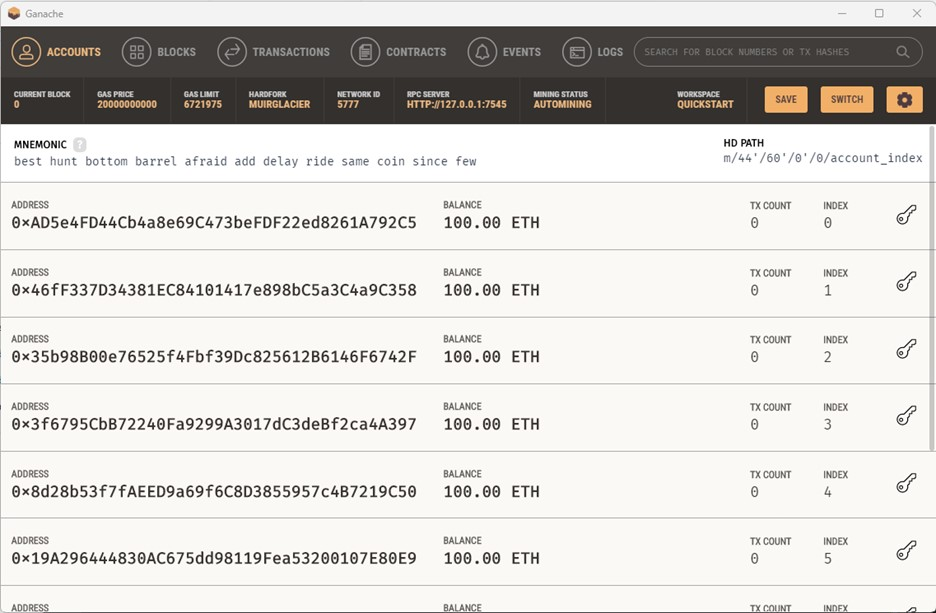
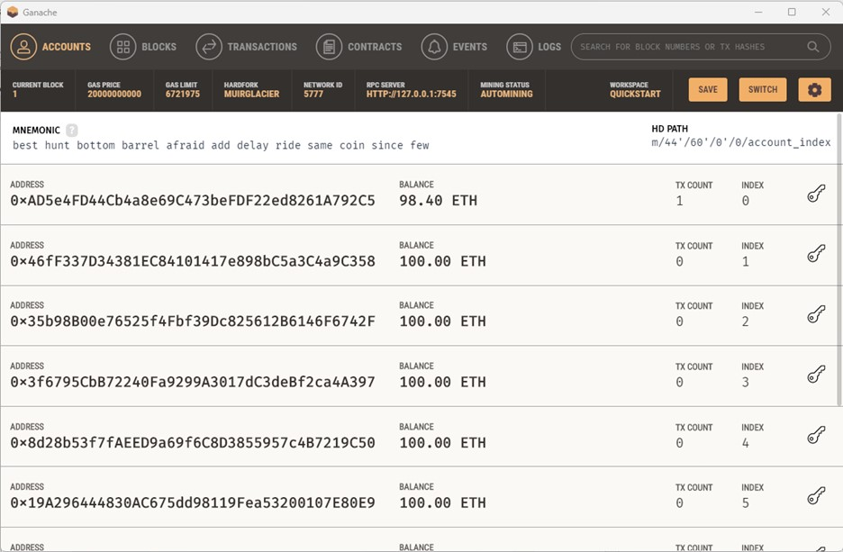
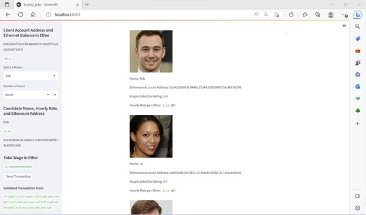

# Module19-HW.blockchainwallets
Module 19 homework - Blockchain Wallets ReadME file

### Ganache transaction details snapshot (before any transactions have been posted)

Screenshot of my address balance and history on Ganache.

### 1st Transaction initiation screenshot

Screenshot of the 1st transaction initiated via krypto_job.py.

### Ganache transaction details after Transaction #1

Screenshot of my address balance and history on Ganache after the 1st transaction was executed.

### 2nd Transaction initiation screenshot

Screenshot of the 1st transaction initiated via krypto_job.py.

### Ganache transaction details after Transaction #2

Screenshot of my address balance and history on Ganache after the 2nd transaction was executed.

